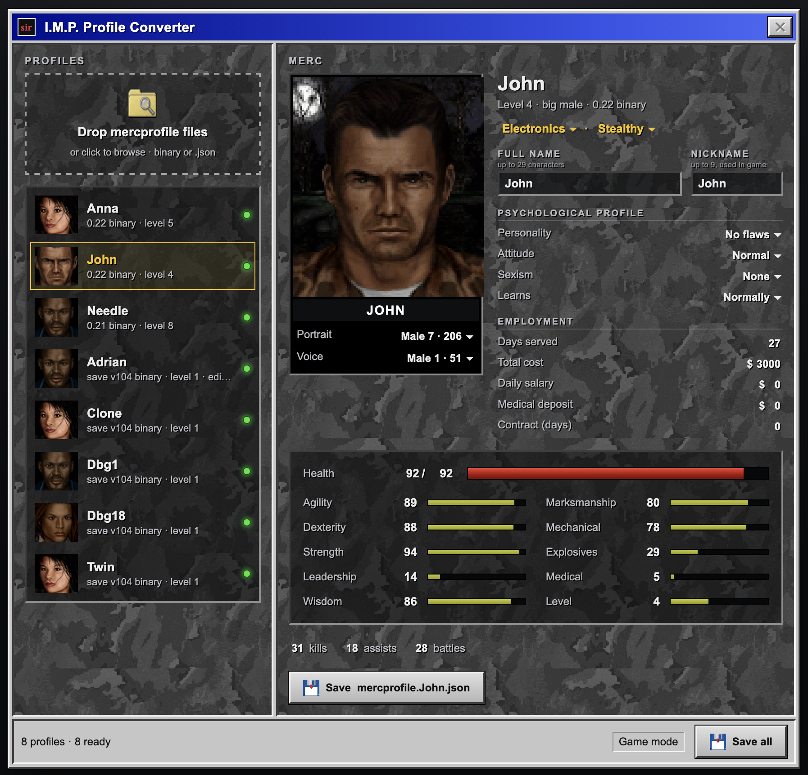

# I.M.P. Profile Converter

Converts the I.M.P. characters older JA2 Stracciatella versions saved (`mercprofile.<nickname>`,
a binary file) into the JSON format the game uses now (`mercprofile.<nickname>.json`). You can
also edit a character before saving it: names, portrait, voice, level, gender, skills,
personality, attributes and more.



Everything happens in your browser. Your profiles and game files are never uploaded.

## Using it

1. Open the converter: `imp-converter.html` in your JA2 folder, or the hosted page.
2. Drop your old `mercprofile.*` files onto it. You'll find them in the `SavedGames` folder
   (`~/.ja2/SavedGames` on Linux and macOS, `Documents\JA2\SavedGames` on Windows).
3. Optional: drop `Data/FACES.SLF` from your JA2 folder onto it to see the portraits. They're
   remembered in that browser.
4. Select a merc, adjust anything you like, and save. Put the `.json` file into `SavedGames`,
   and the game offers the character on the I.M.P. site.

Every value stays within the limits the game accepts, so a saved file always loads.

### Which old files it reads

| Written by           | 64-bit build | 32-bit build |
|----------------------|--------------|--------------|
| 0.21.x release       | 1332 bytes   | 1280 bytes   |
| 0.22.x release       | 1348 bytes   | 1296 bytes   |
| master, save ver 104 | 1356 bytes   | 1300 bytes   |
| JSON, version 1      | any          | any          |

A file's size tells which version wrote it. Names of 16 characters or more were never written
into old files; the converter asks you to type those again. The 32-bit layouts are tested
against rewritten copies of real files, not yet against a real 32-bit file.

## Building the page

After checking out the repository you need [Node.js](https://nodejs.org) 24 or newer:

```sh
cd tools/imp-converter
npm ci            # install the build tools (only needed once)
npm run build     # → dist/imp-converter.html
```

`dist/imp-converter.html` is the whole converter in one file. Double-click it to use it, or
copy it into your JA2 folder.

While working on it:

```sh
npm run dev       # live preview in the browser
npm test          # importers, validation and layouts, against the files in merc-profiles/
```

## Hosting

The GitHub workflow `.github/workflows/imp-converter.yml` tests and builds the page for every
change. On master it also publishes it to GitHub Pages as `index.html`, next to an empty file
named `standalone`, which switches the page to standalone mode. That needs a maintainer to
enable Pages (Settings → Pages → Source: GitHub Actions) and to set the repository variable
`DEPLOY_IMP_CONVERTER` to `true`.

## How it works

- `src/importers/`: one importer per old binary layout. Each is a list of the record's fields;
  the byte offsets are computed as a C compiler lays the struct out, for 64 and 32-bit builds.
- `src/model/`: the JSON format, and the checks the game's own reader makes.
- `src/gamedata/`: item numbers to item names, from `assets/externalized/*.json`, embedded
  at build time together with the I.M.P. portraits and voices from `imp.json`.
- `src/sti/`: readers for the game's archives (`.slf`) and images (`.sti`), used for
  `FACES.SLF`.
- `src/ui/`: the page, in plain TypeScript and CSS.
- `art/generate.mjs`: made the marble texture and the Open/Save icons in `public/ui/`, with
  an image model on OpenRouter and crops of game screenshots in `art/refs/` as style
  references. The key goes into `openrouter-key.txt`, which git ignores.

`merc-profiles/` holds the test profiles: 0.22 files with JSON the game wrote for the same
mercs about a game day later, a 0.21 file, and save version 104 files, among them a clone and
a twin that share a voice.
